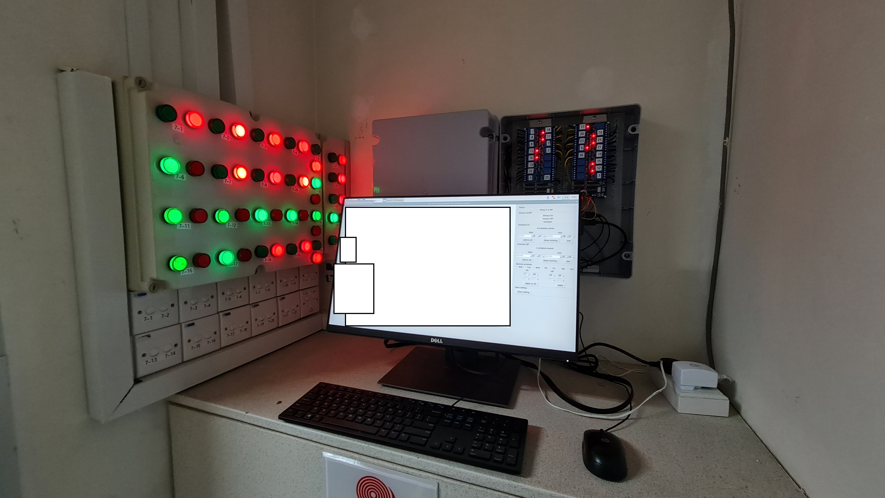

# AC_scheduling_system_with_RaspberryPi

The purpose of this project is to use Raspberry pi to control relays to achieve automatic on/off (scheduling) certain relay. In my case, i use this project to control the on/off of FCU, so in my interface, I have two Frames, one frams display layout and button, another displays setting and status.

## how to use

there're two file you need, 

1. ac_control_gui.py, it's a gui written using Tkinter and Tkcalendar, it'll call the schedule functio from relay_class.py every second (you can change it) and update the interface.
2. relay_class.py, classes that controls relay with a schedule function.

There're two tk frames in ac_control_gui.py, Frame1 is to display the layout and button, Frame2 is to display the setting/status of each relay. put Background.JPG under at_static folder, and adjust the buttons position manually.

change relayList and pinList (GPIO) respectively to suit your need, for me, I need 25 GPIOs because I need 25 relays.

